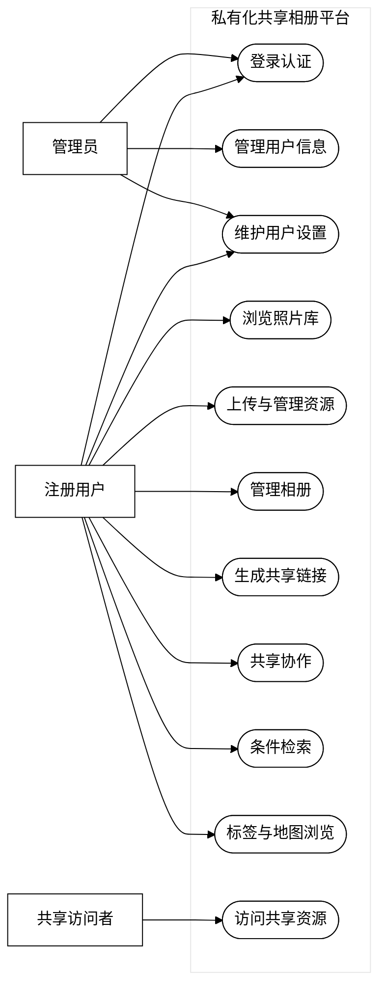
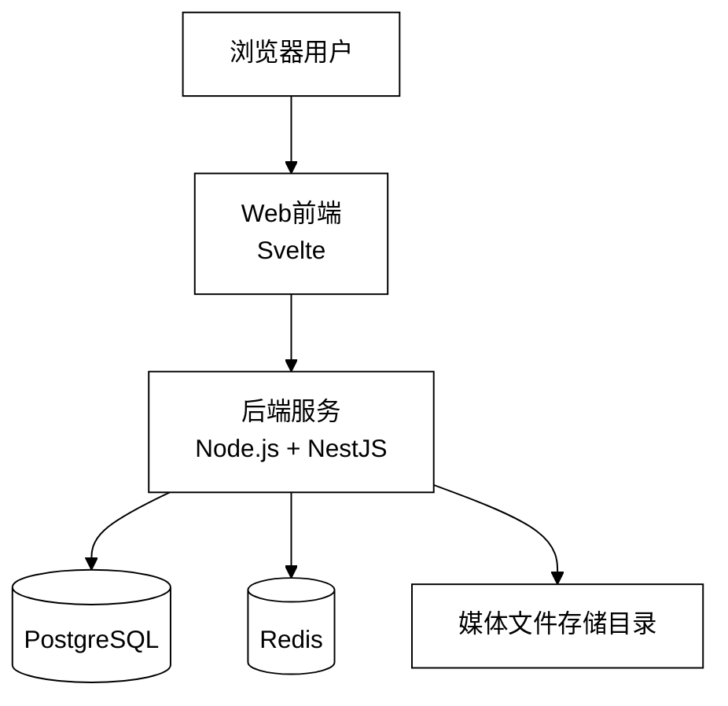
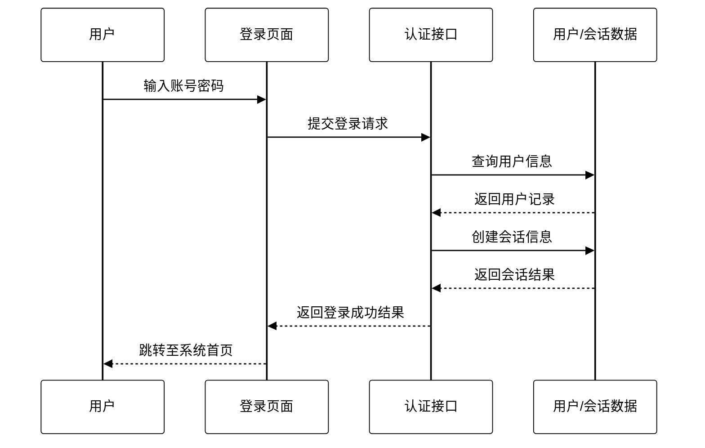
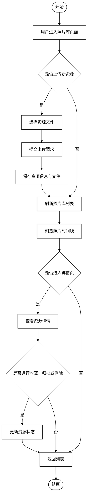
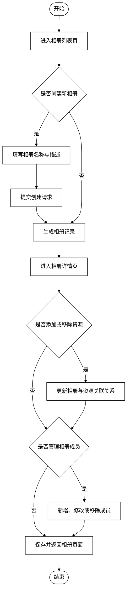
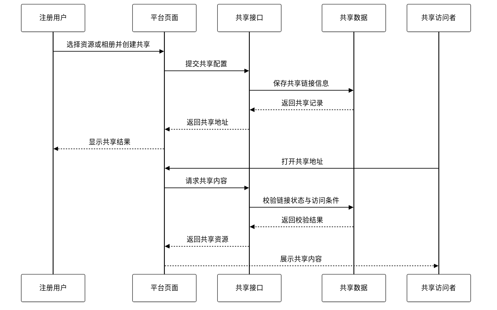
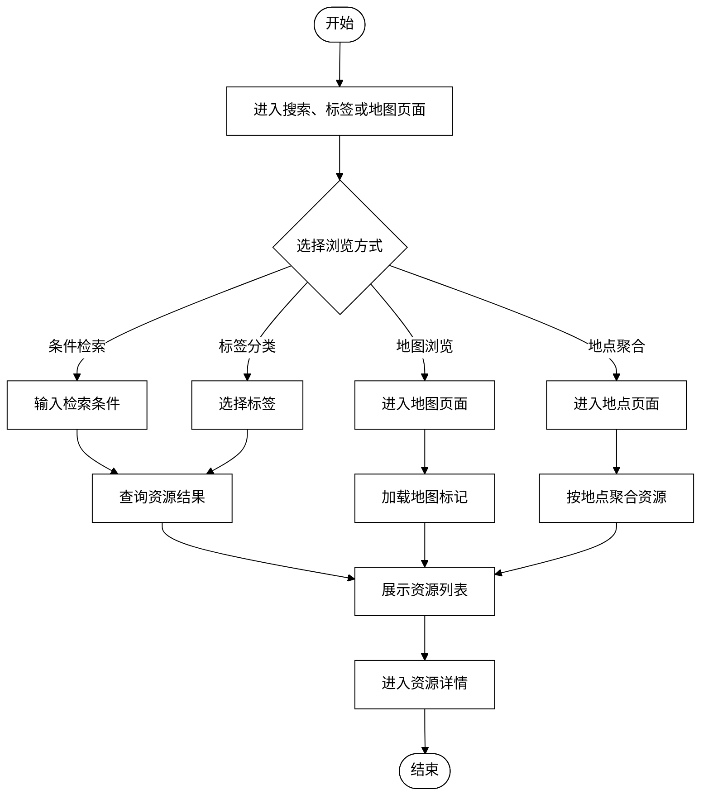
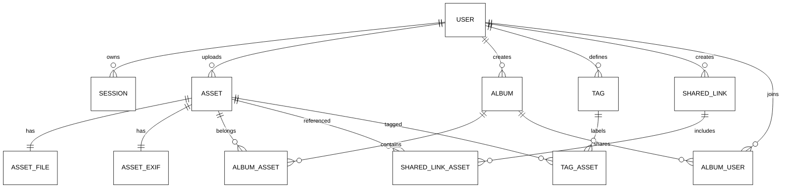
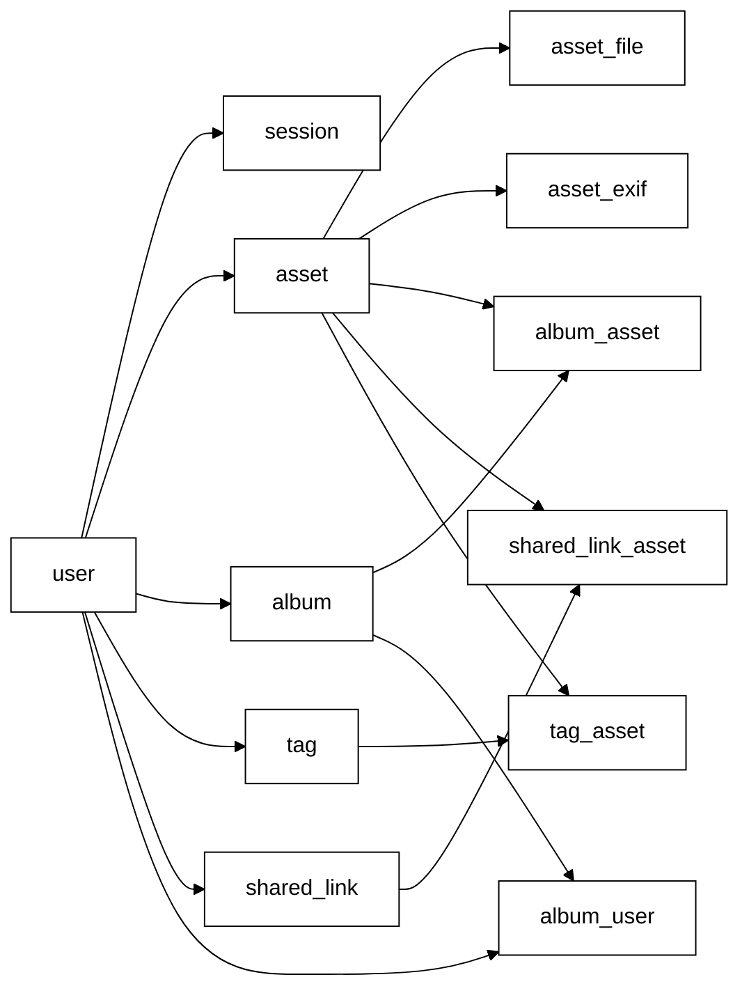

# 论文图表素材

## 使用说明

本文件提供论文所需图表的 Mermaid 源码与说明。

为了尽量贴近学校范本中的传统论文图风格，所有图表统一采用以下样式原则：

- 黑白或灰度
- 纯线框风格
- 直线连接
- 图形简单规整
- 图标题放在图下方
- 导入 draw.io 或 Visio 时不要使用渐变、阴影、彩色高亮

Mermaid 推荐统一初始化样式如下：

```mermaid
%%{init: {
  "theme": "base",
  "themeVariables": {
    "primaryColor": "#ffffff",
    "primaryTextColor": "#000000",
    "primaryBorderColor": "#000000",
    "lineColor": "#000000",
    "secondaryColor": "#ffffff",
    "tertiaryColor": "#ffffff",
    "background": "#ffffff",
    "actorBkg": "#ffffff",
    "actorBorder": "#000000",
    "actorTextColor": "#000000",
    "noteBkgColor": "#ffffff",
    "noteBorderColor": "#000000"
  }
}}%%
```

---

## 图2-1 系统用例图

图下注释建议：

> 图2-1 系统用例图

draw.io 转绘说明：

- 左侧放 3 个角色：管理员、注册用户、共享访问者
- 中间放系统边界矩形
- 系统内部用椭圆表示用例
- 连线尽量水平分布，不交叉



---

## 图3-1 系统总体功能模块结构图

图下注释建议：

> 图3-1 系统总体功能模块结构图

```mermaid
%%{init: {
  "theme": "base",
  "themeVariables": {
    "primaryColor": "#ffffff",
    "primaryTextColor": "#000000",
    "primaryBorderColor": "#000000",
    "lineColor": "#000000",
    "secondaryColor": "#ffffff",
    "tertiaryColor": "#ffffff",
    "background": "#ffffff"
  }
}}%%
flowchart TD
    A["私有化共享相册平台"]
    A --> B["用户认证与用户中心模块"]
    A --> C["照片库模块"]
    A --> D["相册模块"]
    A --> E["共享协作模块"]
    A --> F["检索与地图模块"]

    B --> B1["登录认证"]
    B --> B2["会话管理"]
    B --> B3["用户设置"]
    B --> B4["管理员用户维护"]

    C --> C1["照片时间线"]
    C --> C2["资源上传"]
    C --> C3["收藏与归档"]
    C --> C4["回收站恢复"]
    C --> C5["文件夹视图"]

    D --> D1["相册创建"]
    D --> D2["相册编辑"]
    D --> D3["资源入册移除"]
    D --> D4["相册成员管理"]

    E --> E1["共享链接"]
    E --> E2["共享访问"]
    E --> E3["共享相册"]
    E --> E4["伙伴共享"]

    F --> F1["条件检索"]
    F --> F2["标签分类"]
    F --> F3["地图浏览"]
    F --> F4["地点聚合"]
    F --> F5["结果查看"]
```



---

## 图3-2 系统总体架构图

图下注释建议：

> 图3-2 系统总体架构图

draw.io 转绘说明：

- 上层是浏览器用户
- 中间是 Svelte 前端与 NestJS 后端
- 下层是 PostgreSQL、Redis、文件存储目录
- 采用传统矩形框和数据库圆柱即可



---

## 图3-3 用户认证与用户中心模块时序图

图下注释建议：

> 图3-3 用户认证与用户中心模块时序图



---

## 图3-4 照片库模块活动图

图下注释建议：

> 图3-4 照片库模块活动图



---

## 图3-5 相册模块流程图

图下注释建议：

> 图3-5 相册模块流程图



---

## 图3-6 共享协作模块时序图

图下注释建议：

> 图3-6 共享协作模块时序图



---

## 图3-7 检索与地图模块流程图

图下注释建议：

> 图3-7 检索与地图模块流程图



---

## 图3-8 数据库E-R图

图下注释建议：

> 图3-8 数据库E-R图



---

## 图3-9 数据表关系图

图下注释建议：

> 图3-9 数据表关系图



---

## 表5-1 系统测试用例表

表标题建议：

> 表5-1 系统测试用例表

测试表正文请直接参考 `测试用例表.md`。

---

## 转绘建议

若后续需要导入 draw.io 或 Visio，建议按以下方式处理：

1. 优先保持黑白线框风格。
2. 所有主框使用统一细线边框。
3. 文字统一使用宋体或 Times New Roman。
4. 模块结构图采用纵向树状布局。
5. 时序图和流程图采用标准 UML 或传统流程图样式，不增加装饰元素。


